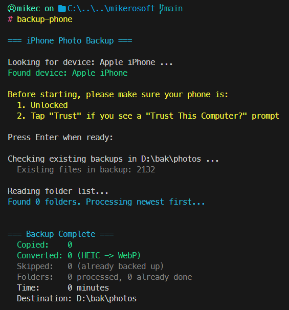

#  backup-phone

Copy every photo and video off your iPhone over USB, no iTunes needed

Windows

<!-- media: hero -->
<!--  -->
<!-- /media: hero -->

## What it is

Plug your iPhone in over USB and this copies all the photos and videos into year/month folders on disk. It does the newest folders first so recent stuff arrives first.

HEIC photos get converted to WebP along the way, keeping the EXIF data. It skips anything that's already been copied, so you can just run it again next time.



## Get it

Paste this into your AI coding agent (Claude Code, Codex, Cursor...):

> Clone https://github.com/mikecann/backup-phone and make it my own. It's one of Mike
> Cann's personal tools, so read the README first, change anything specific to his
> setup to suit mine, then help me get it running.

### Or set it up by hand

You'll need Windows, Git, and Python 3.10 or newer with pip. Make sure `python` is on PATH and launches your Python installation. The launcher uses the Windows PowerShell that comes with Windows.

Run these in PowerShell:

```powershell
git clone https://github.com/mikecann/backup-phone
cd backup-phone
powershell -NoProfile -ExecutionPolicy Bypass -File .\install.ps1
```

The installer checks for `Pillow` and `pillow-heif` and installs missing packages using your Python interpreter. It writes command launchers to `C:\dev\tools` and offers to add that directory to your user PATH. Open a new terminal afterwards. No API keys or `.env` file are needed.

Keep the clone in place because the launchers point to it. Pulling updates doesn't require a reinstall, but moving the clone does.

For a different launcher directory, use `-ToolsDir C:\your\tools`. Use `-SkipDeps` if you've already installed the dependencies, and `-SkipPathUpdate` if you manage PATH yourself. You can also install the Python dependencies directly with `python -m pip install -r requirements.txt`. The clone path must contain only ASCII characters for the CMD launcher.

## Using it

Unlock your iPhone, connect it over USB, and tap **Trust This Computer** if prompted. Then run:

```powershell
backup-phone -Destination "E:\Phone backup"
```

I use `D:\bak\photos` as the default, so pass your own destination if that doesn't suit your setup.

```text
backup-phone [-Destination <path>] [-DeviceName <name>] [-Yes]
```

| Parameter | Default | Description |
|---|---|---|
| `-Destination` | `D:\bak\photos` | Backup root folder |
| `-DeviceName` | `Apple iPhone` | Device name as shown in Explorer, matched as a PowerShell regular expression |
| `-Yes` | Flag | Skip the "press Enter when ready" prompt |

You can run directly from the clone without installing the launchers:

```powershell
.\backup-phone.bat -Destination "E:\Phone backup"
```

## Backup layout and conversion

- Connects through the Windows Shell COM MTP interface, with no iTunes needed.
- Processes phone folders newest first.
- Prefixes each file with its source folder name to avoid collisions, for example `100APPLE_IMG_0001.JPG`.
- Places files in folders such as `2026\sep`, using photo EXIF dates when available and the file's last-write time otherwise.
- Converts HEIC files to WebP at 90% quality, preserving EXIF, while the next file copies. If conversion fails, it keeps the HEIC file instead.
- Checks existing filenames anywhere under the destination before copying.
- Skips `.AAE` sidecar files, which contain iOS edit metadata.

## Organizing an existing flat backup

Preview the moves first:

```powershell
.\organize-existing-backup.ps1 -Destination "E:\Phone backup" -WhatIf
```

Remove `-WhatIf` to move the files into year/month folders. Only files directly in the backup root are moved, existing subfolders are left alone. Filename collisions get a numeric suffix. Add `-Quiet` for summary output.

## Troubleshooting

If the phone isn't found, check that it's unlocked, trusted, and visible in Explorer. The script lists the devices it can see. Use `-DeviceName` if your phone has a different name.

If Python packages are missing, run `powershell -NoProfile -ExecutionPolicy Bypass -File .\deps.ps1` again. The `python` command used at runtime must be the same interpreter you installed the packages into.

The backup uses temporary staging files under `%TEMP%`. Run one backup at a time because the staging directory is shared between runs.

## Uninstalling

```powershell
powershell -NoProfile -ExecutionPolicy Bypass -File .\uninstall.ps1
```

Pass the same `-ToolsDir` if you chose a custom directory. This removes this clone's command launchers. It leaves your backups, Python packages, and the shared PATH entry in place.

## Development

```powershell
python -m pip install -r requirements.txt
python -m unittest discover -s tests -v
powershell -NoProfile -ExecutionPolicy Bypass -File .\tests\test_installers.ps1
powershell -NoProfile -ExecutionPolicy Bypass -File .\tests\test_dependencies.ps1
```

CI runs the Python tests, compiles the Python scripts, parses every PowerShell script, and tests dependency setup and installer setup, reinstall, and removal on Windows. Copying from a real iPhone still needs Windows and a connected phone.

## More tools

You can find my other tools at [mikerosoft.app](https://mikerosoft.app).

MIT licensed.
